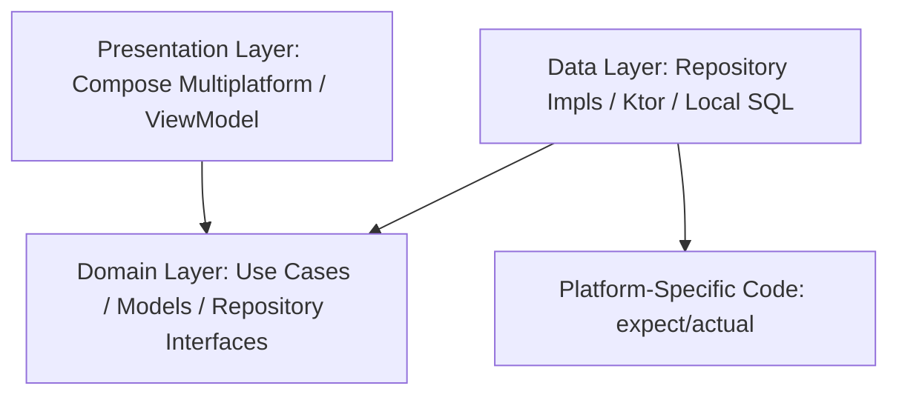

# 🚀 Project Template - Kotlin Multiplatform (KMP)

[](https://kotlinlang.org)
[](https://gradle.org)
[](https://developer.android.com/studio/releases/gradle-plugin)
[](https://openjdk.org)
[](https://github.com/features/actions)
[](LICENSE)
[](CONTRIBUTING.md)
[](https://github.com)
[](https://github.com)
[](https://github.com)
[](https://github.com)
[](https://github.com)

---

This project is a **state-of-the-art Kotlin Multiplatform (KMP) Starter Pack** targeting **Android**, **iOS**, and **Desktop (JVM)**. It leverages the latest ecosystem technologies (Kotlin 2.3.21, Gradle 9.5.0, AGP 9.0, Java 25) and rigorously applies **Clean Architecture** and **Domain-Driven Design (DDD)** principles.

---

<!-- ==========================================
     BADGES DE STATUT DE PROJET PERSONNALISABLES
     Décommentez/copiez simplement le badge correspondant au statut actuel de votre projet.
     ========================================== -->

<!-- STATUT : EN PLANIFICATION (PLANNING) -->
<!-- [](https://github.com) -->

<!-- STATUT : INCUBATION / EN DÉVELOPPEMENT (INCUBATING) -->
<!-- [](https://github.com) -->

<!-- STATUT : STABLE / PRÊT PRODUCTION (STABLE) -->
<!-- [](https://github.com) -->

<!-- STATUT : DEPRÉCIÉ (DEPRECATED) -->
<!-- [](https://github.com) -->

<!-- STATUT : ARCHIVÉ (ARCHIVED) -->
<!-- [](https://github.com) -->

## 🤝 Contribuer / Contributing

Les contributions sont les bienvenues ! Consultez :

Contributions are welcome! See:

- [Guide de contribution / Contributing Guide](CONTRIBUTING.md)
- [Code de Conduite / Code of Conduct](CODE_OF_CONDUCT.md)
- [Politique de Sécurité / Security Policy](SECURITY.md)
- [Support / Assistance](SUPPORT.md)
- [Changelog](CHANGELOG.md)

---

## 🏗️ Project Architecture

The `:shared` module is organized into distinct layers to maximize testability, maintainability, and decoupling:



### Design Layers (`shared/src/commonMain`)
*   **Domain**: Contains pure business rules with zero framework dependencies (Use Cases with `invoke` operator, self-validating models, repository interfaces).
*   **Data**: Concrete repository implementations, network communication, and database layer.
*   **Presentation**: Immutable `UiState` modeling and ViewModels using asynchronous `StateFlow`.
*   **Dependency Injection (DI)**: Centralized multiplatform configuration via **Koin**.

---

## ⚡ CI/CD Workflow

The GitHub Actions pipeline ([ci.yml](file:///.github/workflows/ci.yml)) implements a dual-speed system optimized for bandwidth and compute time:

- **Fast-Track (Feature branches)**: Compiles and tests only the local JVM target (`./gradlew :shared:jvmTest`). Runs in under 10 seconds.
- **Deep-Testing (Branches / Pull Requests to `master`)**: Runs the full test suite (`./gradlew allTests`) on all simulators and target platforms to validate code quality before production.

---

## 🛠️ Useful Development Commands

### Run local tests (JVM Fast-Track)
```bash
./gradlew :shared:jvmTest
```

### Run all tests (All targets)
```bash
./gradlew allTests
```

### Generate Gradle Wrapper
```bash
gradle wrapper
```