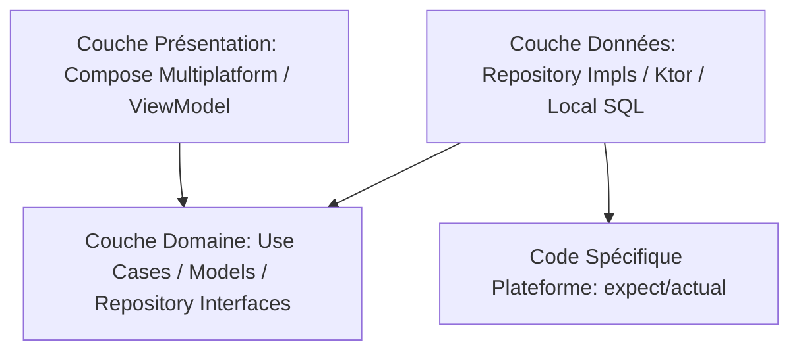

# 🚀 Project Template - Kotlin Multiplatform (KMP)

[](https://kotlinlang.org)
[](https://gradle.org)
[](https://developer.android.com/studio/releases/gradle-plugin)
[](https://openjdk.org)
[](https://github.com/features/actions)

<!-- ==========================================
     BADGES DE STATUT DE PROJET PERSONNALISABLES
     Décommentez/copiez simplement le badge correspondant au statut actuel de votre projet.
     ========================================== -->

<!-- STATUT : EN PLANIFICATION (PLANNING) -->
<!-- [](https://github.com) -->

<!-- STATUT : INCUBATION / EN DÉVELOPPEMENT (INCUBATING) -->
[](https://github.com)

<!-- STATUT : STABLE / PRÊT PRODUCTION (STABLE) -->
<!-- [](https://github.com) -->

<!-- STATUT : DEPRÉCIÉ (DEPRECATED) -->
<!-- [](https://github.com) -->

<!-- STATUT : ARCHIVÉ (ARCHIVED) -->
<!-- [](https://github.com) -->

---

Ce projet est un **Starter Pack de pointe pour Kotlin Multiplatform (KMP)** ciblant **Android**, **iOS** et **Desktop (JVM)**. Il intègre les dernières technologies de l'écosystème (Kotlin 2.3.21, Gradle 9.5.0, AGP 9.0, Java 25) et applique rigoureusement les principes de la **Clean Architecture** et du **Domain-Driven Design (DDD)**.

---

## 🏗️ Architecture du Projet

Le module partagé `:shared` est organisé en couches distinctes pour maximiser la testabilité, la maintenabilité et le découplage :



### Couches de Conception (`shared/src/commonMain`)
*   **Domaine (Domain)** : Contient les règles métiers pures sans dépendances de framework (Cas d'utilisation avec opérateur `invoke`, modèles auto-validés, interfaces de dépôt).
*   **Données (Data)** : Implémentations concrètes des dépôts, communication réseau et base de données.
*   **Présentation (Presentation)** : Modélisation d'état d'UI (`UiState`) immuable et ViewModels utilisant des `StateFlow` asynchrones.
*   **Injection de Dépendances (DI)** : Configuration centralisée multiplateforme via **Koin**.

---

## ⚡ Workflow CI/CD (Intégration Continue)

Le pipeline GitHub Actions ([ci.yml](file:///.github/workflows/ci.yml)) implémente un système de double-vitesse optimisé pour la bande passante et le temps de calcul :

- **Fast-Track (Branches secondaires)** : Ne compile et ne teste que la cible JVM locale (`./gradlew :shared:jvmTest`). Exécution instantanée en moins de 10 secondes.
- **Deep-Testing (Branches / Pull Requests vers `master`)** : Exécute l'ensemble des tests (`./gradlew allTests`) sur tous les simulateurs et plateformes cibles pour valider la qualité du code avant la mise en production.

---

## 🛠️ Commandes Utiles de Développement

### Exécuter les tests locaux (Fast-Track JVM)
```bash
./gradlew :shared:jvmTest
```

### Exécuter tous les tests (Toutes cibles)
```bash
./gradlew allTests
```

### Générer le Gradle Wrapper
```bash
gradle wrapper
```